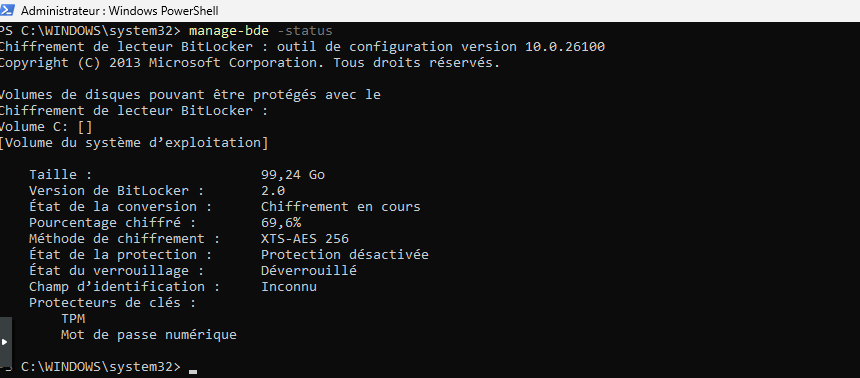

# CheckBitlocker.ps1

## 📄 Description

This PowerShell script checks whether the system drive (C:) is encrypted with BitLocker.  
If the volume is found to be fully decrypted, the script:

- Automatically enables BitLocker encryption using TPM and XtsAes256.
- Adds a BitLocker recovery password protector.
- Saves the recovery key to a specified file.
- Logs each action (start, status, encryption, errors) in a log file.

## ✅ Features

- Checks if the system disk (`C:`) is already encrypted.
- Automatically starts encryption if not yet enabled.
- Saves the recovery key to `C:\Windows\Temp\bitlocker-recovery.txt`.
- Logs all actions with timestamps to a dedicated log file.
- Automatically creates log directories and files if they do not exist.

## 🖼️ Screenshot

Below is an example screenshot showing BitLocker encryption in progress:

## 🛠️ Usage

1. **Modify Log Path (Optional):**  
   By default, the log file is saved to: C:\Programdata\Labdirectory